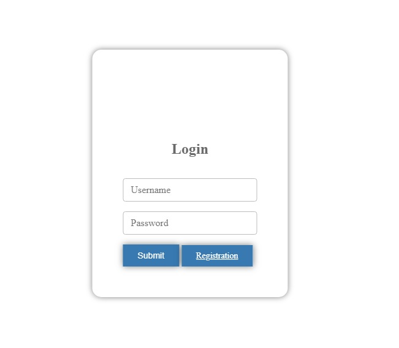
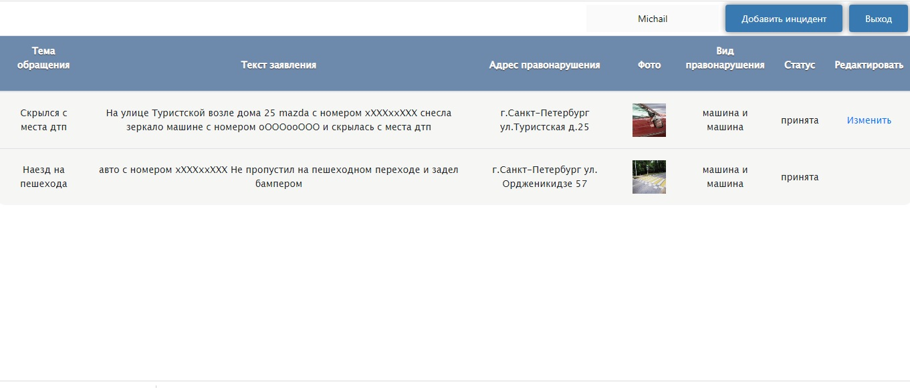
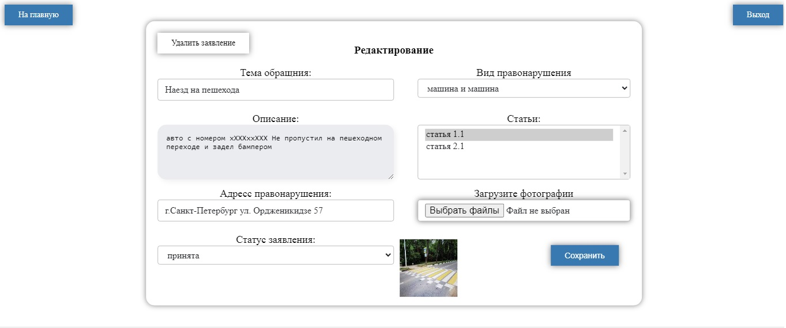
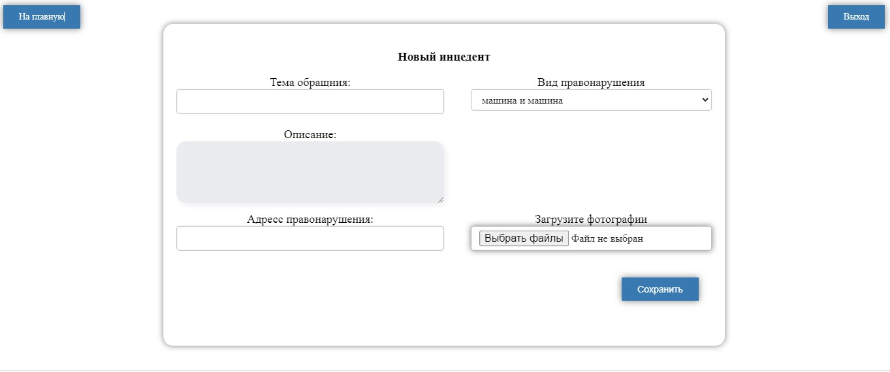

Описание:
Сервис для размещения и обработки автонарушений
В системе существуют две роли. Обычные пользователи и автоинспекторы.
Пользователь добавляет описание автонарушения.
В заявлении указывает: адрес, описание нарушения и фотографию нарушения.
У заявки есть статус. Принята. Отклонена. Завершена.

Используемые технологии:
- Servlet
- Spring MVC
- Spring Security & JWT authorization
- Spring jdbc (заменен на Spring Data)
- Hibernate (заменен на Spring Data)
- Spring Data JPA
- PostgreSQL
- Liquibase
- JSP (JavaServer Pages)
- JSTL (JSP Standard Tag Library)
- CSS 
- Log4j

